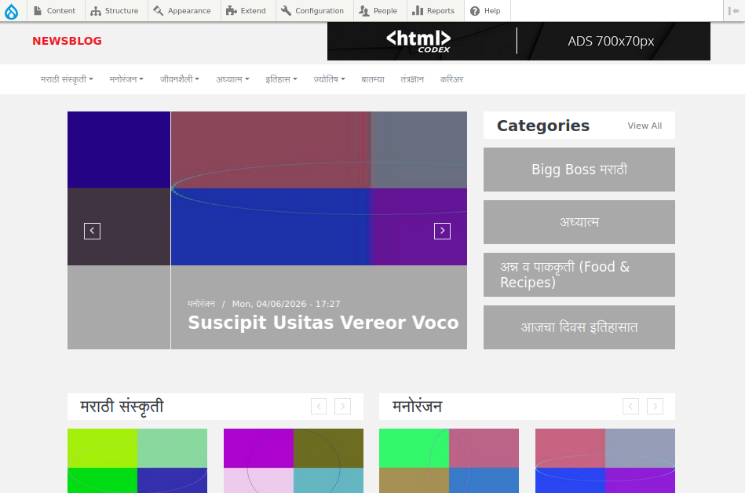
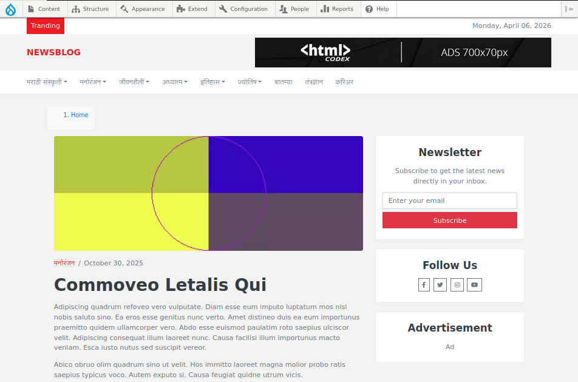

# 📰 Drupal News Blog Website

## 🚀 Features
- News article publishing
- Category & tags system
- SEO optimized URLs
- Multilingual support (Hindi / Marathi / English)
- Admin dashboard for content management

## 🛠 Tech Stack
- Drupal 10
- PHP
- MySQL
- Bootstrap
- Custom Theme

## 📸 Screenshots

## 👨‍💻 My Role
- Designed and developed a complete Drupal 10 news blog website from scratch 
- Created and managed custom content types such as News, Categories, and Tags 
- Configured SEO modules including meta tags, XML sitemap, and clean URL structure 
- Implemented multilingual functionality (English, Hindi, Marathi) for better reach 
- Customized themes and improved UI for better user experience 
- Managed site configuration, performance optimization, and content workflow 

## ⚙️ Setup Instructions

